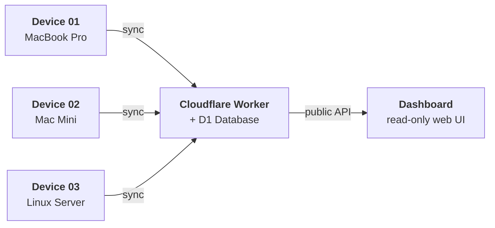

<p align="center"><code>npm i -g @aiusage/cli</code></p>

<p align="center">
  <strong>AIUsage</strong> tracks token usage and costs across all your AI tools and devices,<br>
  syncs to your own Cloudflare Worker, and visualizes everything on a public dashboard.
</p>

<p align="center">
  <a href="./README.zh-CN.md">简体中文</a> | English
</p>

<p align="center">
  <a href="https://www.npmjs.com/package/@aiusage/cli"></a>
  <a href="https://workers.cloudflare.com"></a>
  <a href="https://developers.cloudflare.com/d1"></a>
  <a href="LICENSE"></a>
</p>

<p align="center">
  <a href="https://aiusage.yizhe.me"><strong>Live Demo</strong></a>
</p>

---

## What is AIUsage?

A self-hosted, privacy-first system for tracking how much you spend on AI coding tools — across every device you own.

### Supported Tools

<p align="center">
  
  
  
  
  
  
  
  
</p>
<p align="center">
  
  
  
  
  
</p>

### Why AIUsage?

- **Scans locally** — reads token usage from session logs, never touches conversation content
- **Syncs across devices** — every machine enrolls with its own secure token, data merges on your Worker
- **Visualizes costs** — public dashboard with trends, model breakdowns, cost per session, and more
- **You own the data** — deploys to your Cloudflare account (free tier is enough), no third-party services

### Architecture



## Quickstart

### Deploy with your AI agent

Copy this prompt, paste it into your AI coding agent (Claude Code, Codex, Copilot, Gemini, etc.):

```text
Clone https://github.com/ennann/aiusage.git, read skills/aiusage-server/aiusage-server.md,
and help me deploy AIUsage to my Cloudflare account.
After the server is up, follow skills/aiusage-cli/aiusage-cli.md to connect this device.
```

### Or deploy manually

```bash
git clone https://github.com/ennann/aiusage.git
cd aiusage && pnpm install
npx wrangler login
pnpm setup
```

### Local reports (no server needed)

```bash
npm i -g @aiusage/cli
aiusage report --range 7d
```

## Staying Up to Date

AIUsage uses a **fork-based update model** — fork this repo, connect your fork to Cloudflare Workers via Git integration, and updates flow automatically.

1. **Fork** this repository to your GitHub account
2. **Connect** your fork to Cloudflare Workers (Git integration)
3. **Sync** upstream updates via GitHub's "Sync fork" button or `git merge upstream/main`
4. Cloudflare **auto-redeploys** on every push to your fork

CLI updates are separate: `npm update -g @aiusage/cli`

See the [**Update Guide**](./docs/update-guide.md) for detailed instructions, including fully automatic sync via GitHub Actions.

## Docs

| Document | Description |
|----------|-------------|
| [**Deployment Guide**](./docs/deployment-guide.md) | Full setup walkthrough, CLI reference, API docs |
| [**Update Guide**](./docs/update-guide.md) | Fork-based update mechanism and auto-deploy setup |
| [**CLI README**](./packages/cli/README.md) | CLI tool details and all commands |


## License

[MIT](LICENSE)
